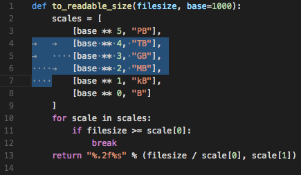

## WhiteViz

An extension for whitespace visualization

### What is WhiteViz?
WhiteViz is simply an extension that visualize the whitespace upon selection. Explicitly made for [this issue](https://github.com/Microsoft/vscode/issues/1477) for the Visual Studio Code.

Most whitespace characters (including full-width characters) are already support out of the box!

### How WhiteViz different from built-in whitespace rendering?
- Expanded / Full tab indicator
- Selection with / without word boundary
- EOL visualization
- Custom indicator symbol

If you just want simple whitespace rendering on selection, WhiteViz kindly recommended that you use built-in
whitespace rendering instead.

### How to use it?
Simply install the extension, and you can use it right away (after restart)!

### Contributors

@chmln : For the expanded tab indicator from BetterWhiteSpace
